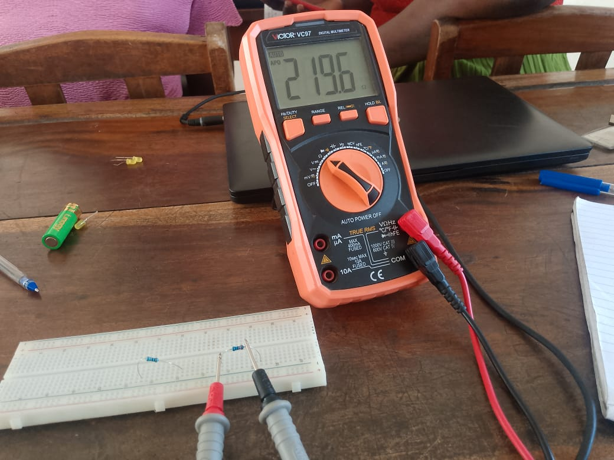
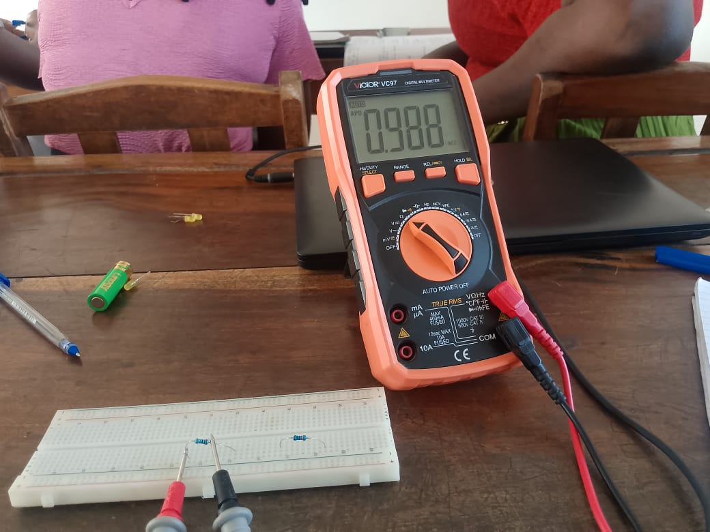
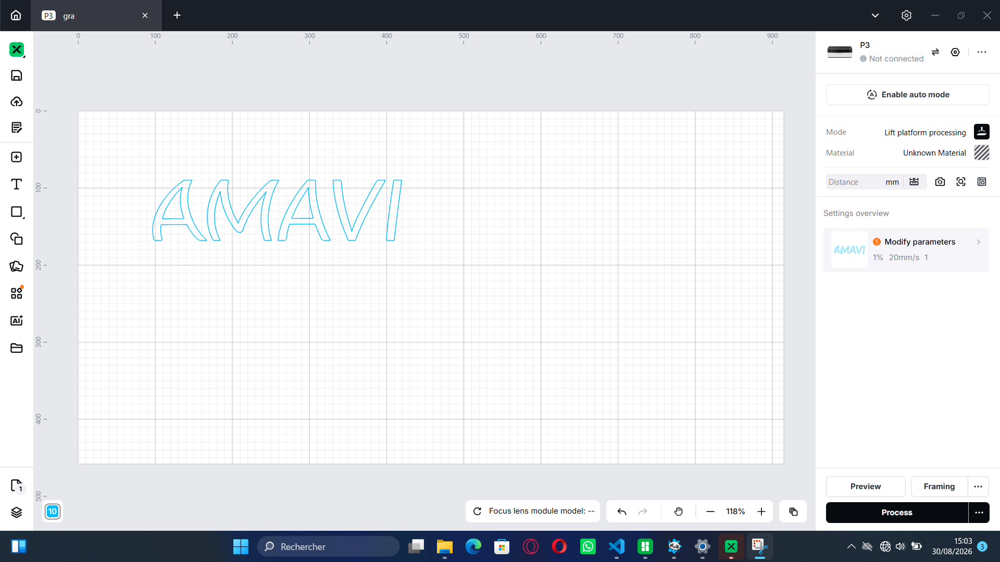

# Journal du 26 août 2026 (rédigé par : AMAVI Améyo)
## Fait aujourd'hui

   ### Atelier n°1

 La découpe laser: 
- La générarité sur le laser
- Les grandes familes de laser industriels(CO2, fibres, diode, UV)
- Installation et découverte du logiciel xtool
- Réalisation de la gravure du nom de AMAVI.
### Atelier n°2

**Rappel des bases de l'éléctronique dans les fablabs**: 
      
- Mesures électriques, multimètre et périfériques d'entrée/sortie

    Les grandeurs électriques de bases: tension, courant, résistance.

     Rapel du mode de fonctionnement d'un multimètre.
     Mesure de la tension et de résistance de quelques accumulateurs (piles).

 ### Atelier n°3

- Découverte et fonctionnement de l'imprimante 3D

### Atelier n°4
  Rédaction du journal
## Appris

- j'ai appris à réaliser la gravure de nom de AMAVI
- J'ai mésuré la tension et la résistance de quelques accumulateurs(piles) avec le multimètre 
### Raté, puis corrigé

  j'ai raté l'installation mais avec l'appui des encadreur j'ai fini par l'instaler.

### Décidé

 Je décide de m'entrainer régulièrement sur le logiciel xtool studio

### À faire demain

 Passage individuel pour la découpe laser de gravure réalisée à base du logiciel xtool 

**PHOTOS DU JOUR**

