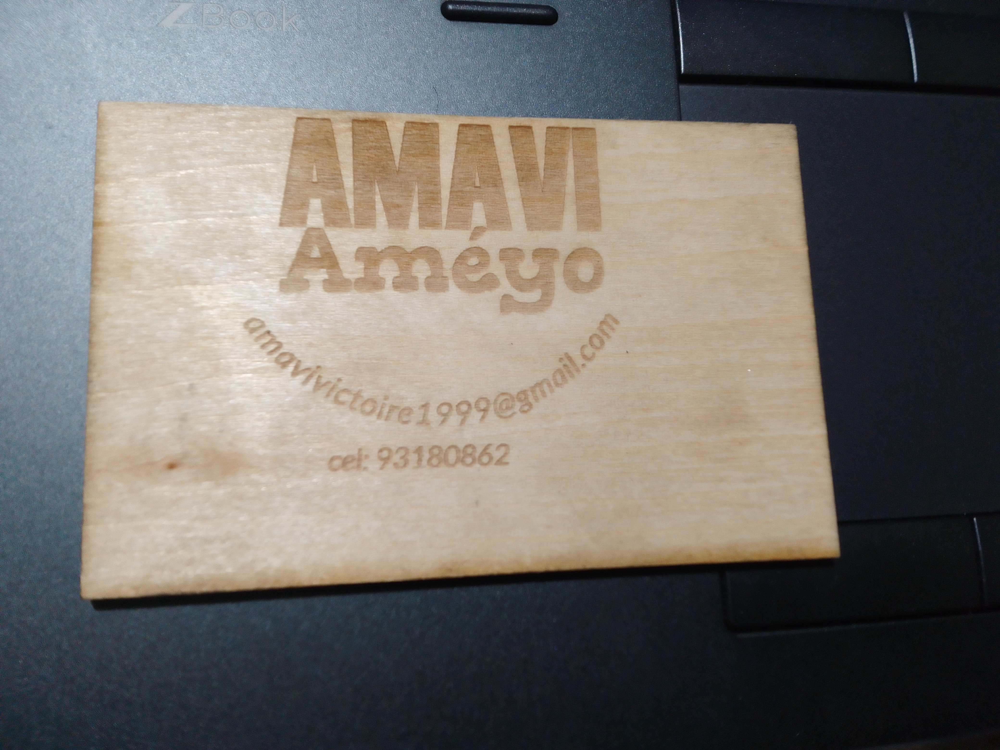
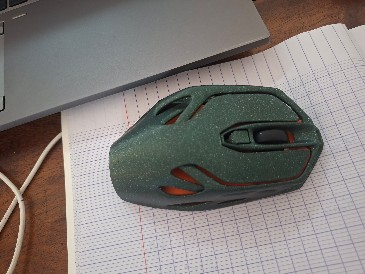

# Journal du 27 août 2026 (rédigé par : AMAVI Améyo)

## Fait aujourd'hu
### Atelier n°1

L'impression 3D
- Instalation et découverte du logiciel bambu studio
- Généralité sur quelques filamemts: PLA,PETG,PTU.
 
  Le filament PLA,capable de résister jusqu'à la température allant 150°C contrairement au PETG qui sont conçus pour résister à des tempéerature supérieur à 100°c
- Rélisation d'un plateau de diamètre 0,4mm, le filament utilisé est le generic PETG, le motif de remplissage est gyroide
- Exemple de porte souris imprimé par l'impression 3D

### Atelier n°2

- Installation du logiciel autodesk fusion
### Atelier n°3
- Gravure et découpe d'une carte de visite de largeur 55mm et de hauteur 85mm avec xtool
### Atelier n°4
- Installaion et découverte du logiciel mbock
- Découverte du cyberpi
- connaitre les éléments du kit du cyberpi
- Programmation des codes des feux tricolors

## Ce que je retiens

- Je retiens le mode de fonctionnement des filament comme le PLA et PETG
- Je retiens la réalisation d'un plateau à base du logiciel bambu studio
- J'ai appris à installer le logiciel et à creer un compte sur ce logiciel
- J'ai appris à réaliser une carte de visite de paramètre suivant Nom, Prénom, Email et téléphone
## Raté, puis corrigé

- L'installation de bambu studio est ambigu mais avec plusieure tantatives j'ai fini par l'installer

## Décidé

  Je décide de s'exercer énormement sur le logiciel bambu studio et s'outiller à l'utilisation de xtool

## À faire demain

- Finaliser la réalisation du plateau avec l'impression 3D dirigé par l'ingénieur LOLO

**LES PHOTOS DU JOUR**

