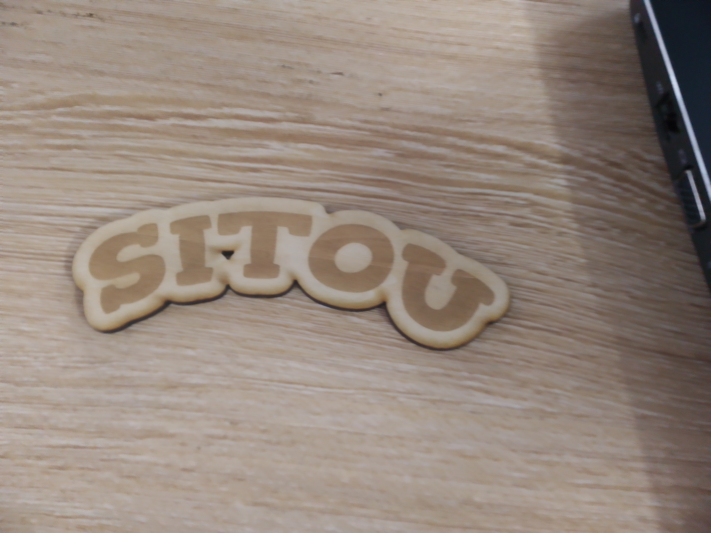
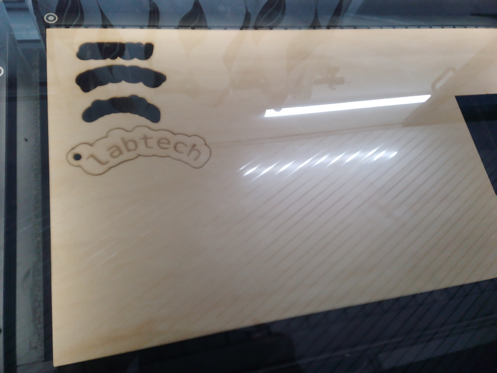
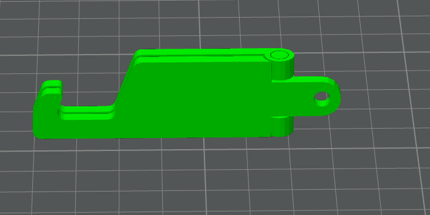
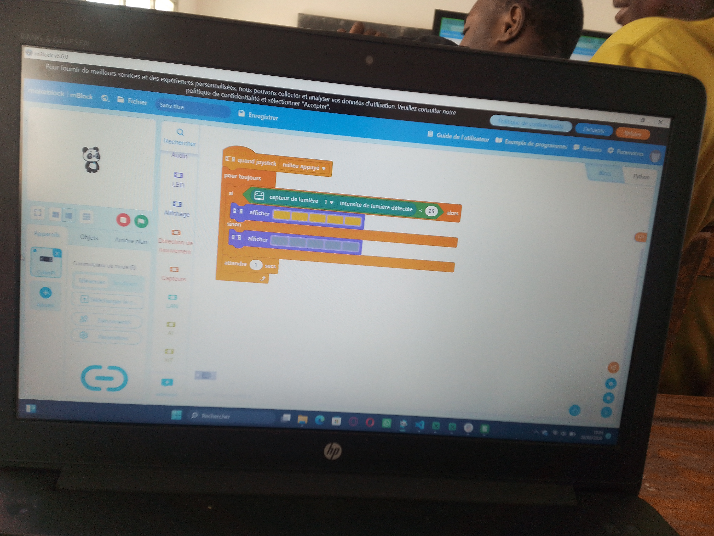
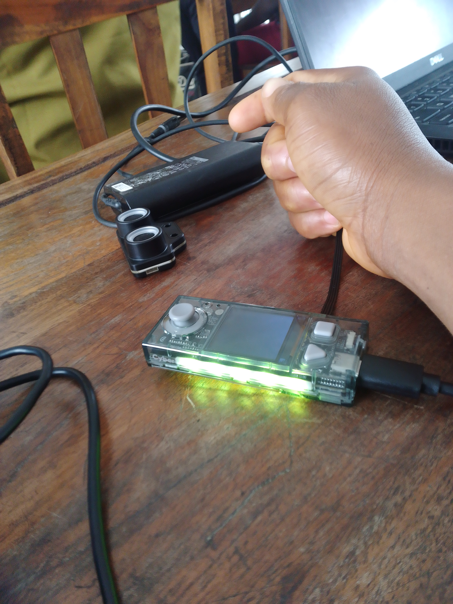

# Journal du 28 août 2026 (rédigé par : AMAVI Améyo)

## Fait aujourd'hui

### Atelier n°1
- Rélisation de la découpe de certaines gravures de noms

### Atelier n°2
- Tranchage du ficher foldable-phone-stand-bambusti
- L'impression du ficher

### Atelier n°3
Programmation de code de couleur envoyé sur la cyberbi

 
## Appris

- j'ai appris à relier le cyberpi à capteur de lumière puis programmé un code de couleurs de la sorte que la LEED brille dans la journée et s'éteint pendant la nuit
- j'ai appris la découpe de certains gravures de nom
- J'ai appris egalement à travailler un projet par desig thinking

## Raté, puis corrigé

- La programmation est mal comprise, avec plusieurs tentive de réposes j'ai compris le cotenu de la programmation et abouti au résultat

## Décidé

- je decide de s'exercer avantage sur le logici mblock

## À faire demain

- Faire la récapitulation de différent projet sélèctionné par groupe par les formateurs

   **PHOTOS DU JOUR**

 