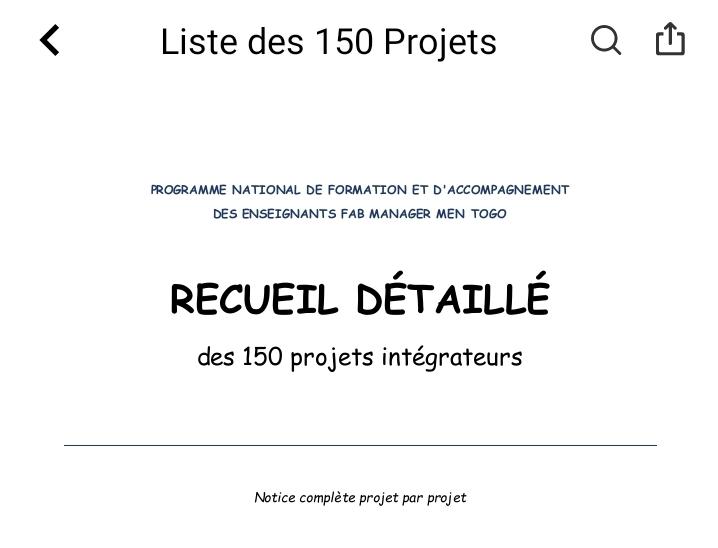

# Journal du 29-08-2026 (Rédiger par: AMAVI Améyo)
 
## Fait aujourd'hui

- Choix d'un projet par groupe à base de la méthode design thinking dans les 150 projets intégrateurs

-  Présentation du projet groupe par groupe et validation par les formateurs

## Appris

j'ai appris à choisir un projet par désign thinking

## A faire demain

 Etablir le cahier de charges du projet et élaborer la liste des composants par chaque membre du groupe