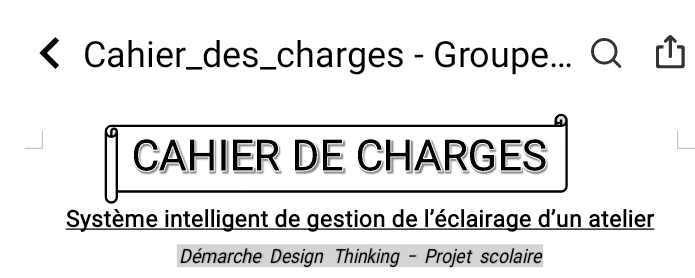
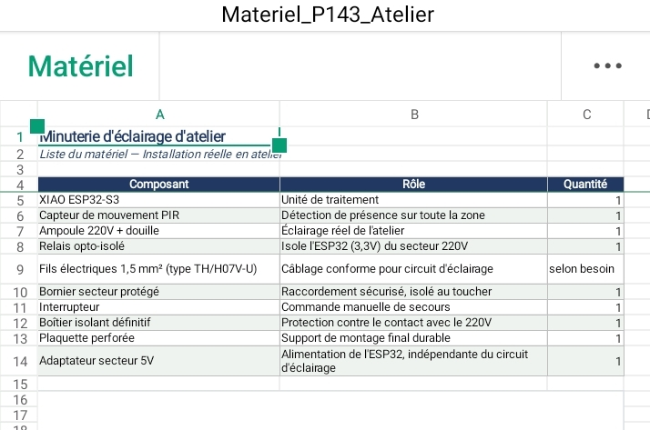

# Journal du 31 Août 2026 (Rédigé par AMAVI AMéyo)

## Fait aujourd'hui

- L'analyse des besoins et l'établisement du cahier de charges du projet minuterie d'extinction automatique d'un atelier

- Le choix technologique et le matériel

- Réalisation d'un cube en autodesk fusion en mode d'esquise et révolutionnaire

## Appris

J'ai appris à créer un cube avec autodesk fusion et établir la liste des composantes d'un projet

## Raté, puis corrigé

Je n'est pas réussir à créer le cube au premier essai, avec plusieurs tantatives, j'ai réussir par créer

## Décidé

La décision prise est de s'entrainer beaucoup plus sur autodesk fusion
## A faire demain

Travail individuel dans le groupe dans trois atelier

