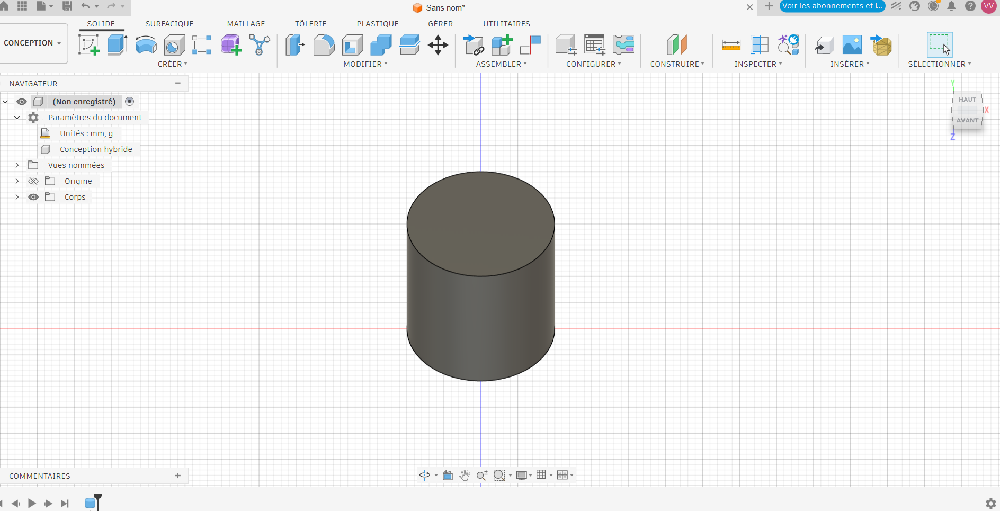
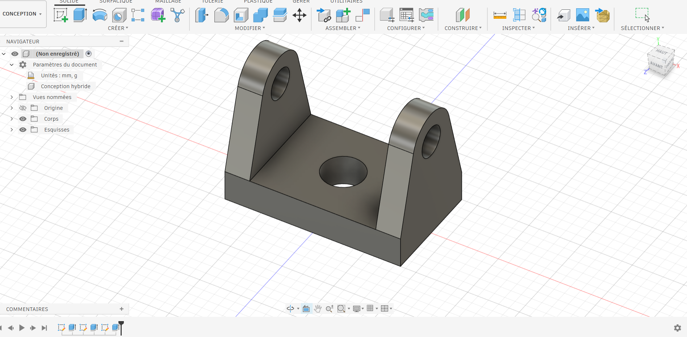
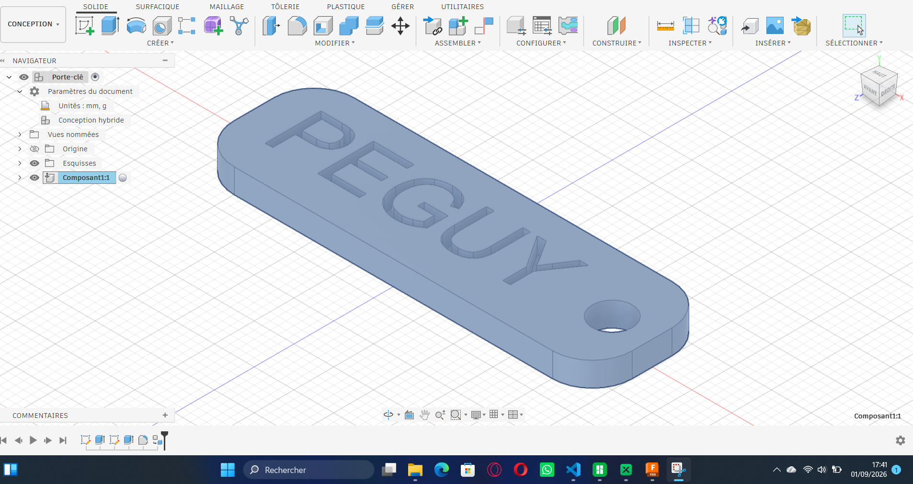
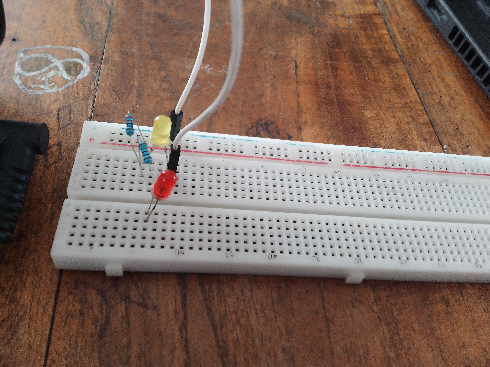
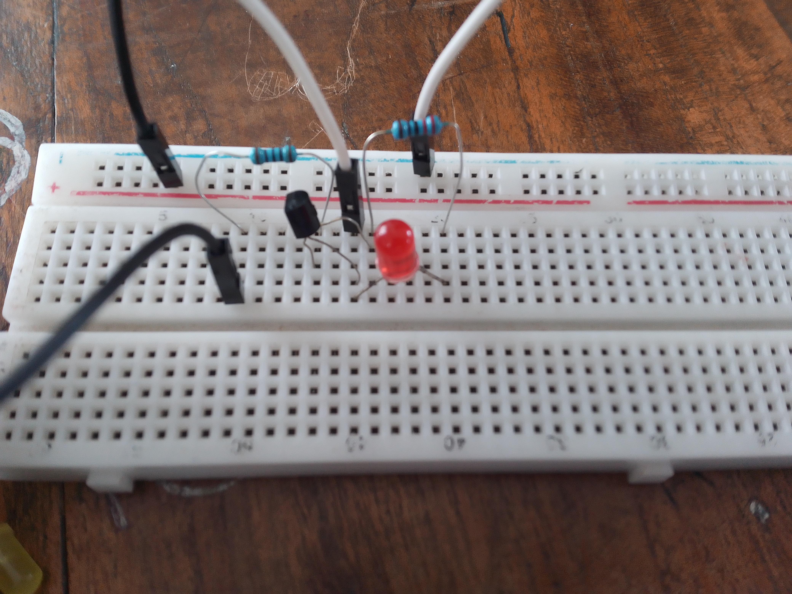
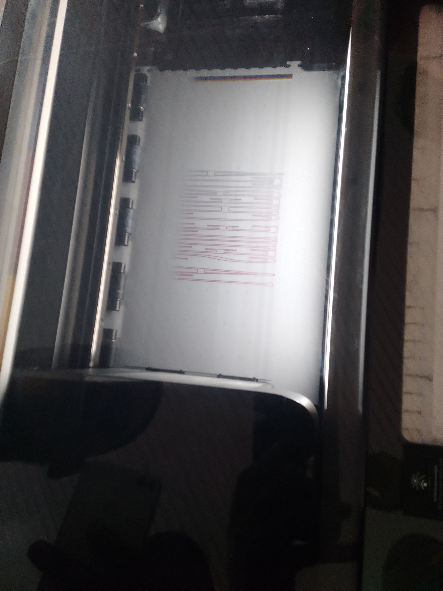
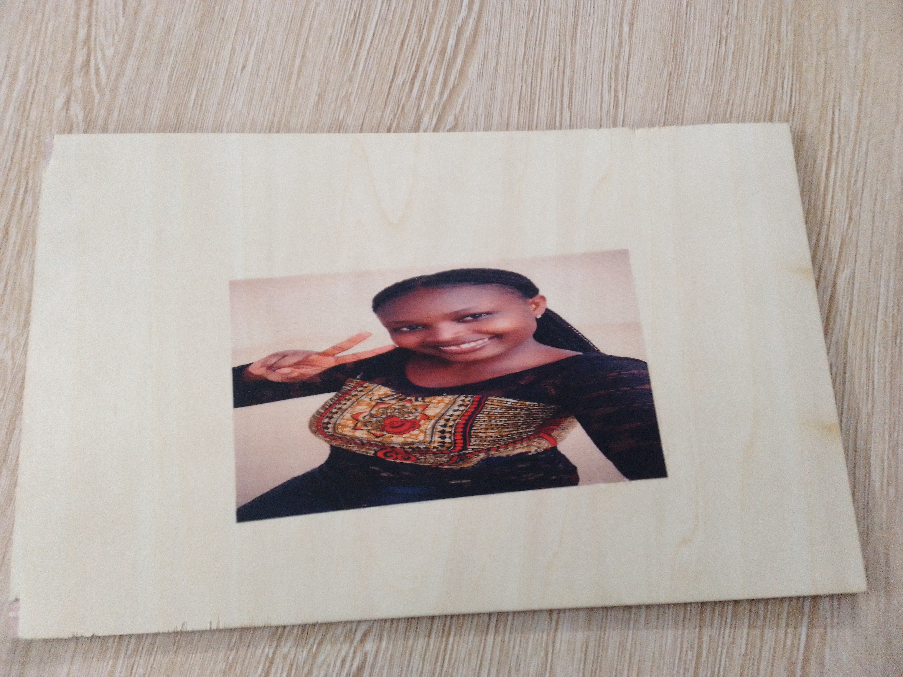
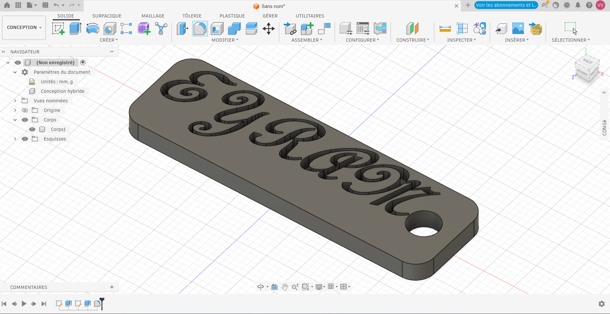

# Journal du 01-09-2026 (Rédigé par: AMAVI Améyo)

## Fait aujourd'hui

### Atelier n°1
Foctionnement de la plaquette SK10

- Les types de connexion pour une plaquette breadboard: connexion vcerticale et la connexoin horizontale
- Montage en série comprenant un générateur, une DEL(LED) et une résistance
- Montage d'un circuit comprenant un générateur, deux(02) résistances et deux(02) LED
- Montage d'un circuit comprenant un générateur, une LED, un transistor et deux(02) résistances

### Atelier n°2

L'impression DTF avec xtool

- Description de l'impression dtf
- Les étapes DTF avec xtool sont: préparation du ficher, impression xtool, poudrage, cuisson, pressage
- Un exemple de l'impression DTF avec xtool d'une image

### Atelier n°3

Réalisation dans autodesk fusion

- Créaction d'un cylindre en mode d'éesquise et révolutionnaire
- Créaction d'une pièce en trois dimensions
- Rappel du fonctionnement de la pierre coulisse
- Créaction d'une porte-clé 

## Appris

J'ai appris à réaliser les trois types de montanges à base de plaquette SK10; traiter une image en impression DTF dans xtool; créer un cylindre, une pièce en trois dimensions et une porte-clé.

## Raté,puis corrigé

J'ai raté le traitement d'une image à base de l'impression DTF dans xtool,la créaction d'un cylindre, d'une pièce en trois dimensions dans autodesk fusion mais avec plusieurs essais j'ai réussi à tous

## Décidé

- Je décide de faire des exercices dans les logiciels suivants:xtool à base de l'impression DTF, autodesk fusion
- je décide également de s'entrainer plus sur la plaquette breadboard SK10

## A faire demain

Passage de groupes dans les ateliers respectifs

**PHOTOS DU JOUR**

      

