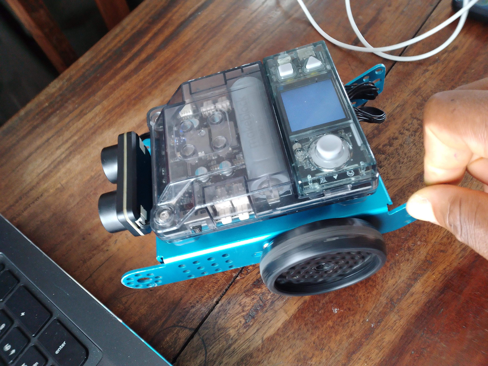

# Journal du 02-09-2026 (Rédigé par: AMAVI Améyo)

## Fait aujourd'hui

### Atelier n°1
- Montage d'un robot
- Programmation de codes à faire avancer le robot
- Programmation de codes pour guider le robot à changer de direction s'il rencontre un obstacle
### Atelier n°2
- Initialisation sur l'algorithme

### Atelier n°3
Réalisation de l'esquise du projet: minuterie d'extinction automatique d'un atelier

## Appris
- J'ai appris à faire le montage d'un robot, programmer de codes pour faire avancer le robot et programmer egalement de codes à changer de direction s'il rencontre un obstacle
- J'ai appris également à réaliser l'esquise d'un projet 
## Raté, puis corrigé
Tout est bien réalisé, pas d'erreur
## Décidé
Je decide de s'exercer d'avantages sur xtool
## A faire demain
Travailler dans les ateliers

**PHOTOS DU JOUR**

 

