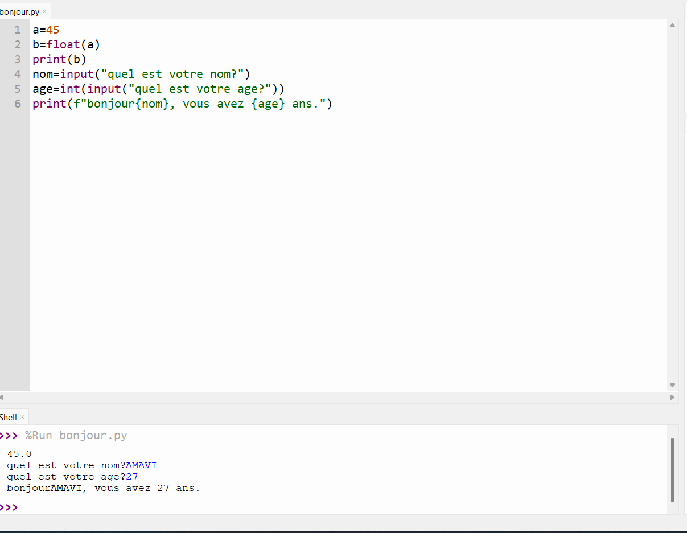
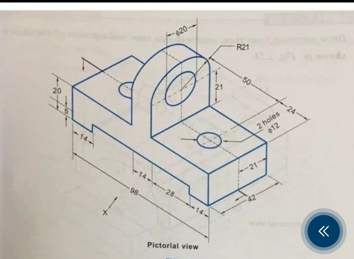
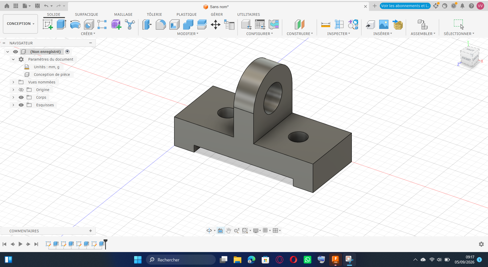

# Journal du 04-09-2026 (Rédigé par: AMAVI Améyo)

## Fait fait aujourd'hui

### Atelier n°1
La suite du cours de programmationen en python

### Atelier n°2
Découverte de la fabrication des PCB
### Atelier n°3
Réalisation de la pièce suivante

en 3D avec fusion 360

## Appris
- Utiliser les variables: float, bool
- Utiliser les conditions: if, elif, else pour écrire un code en python
- Utiliser le boucle for
- Convertyir les types et affichages avec f-string
- Utiliser la fonction inpout
## Raté, puis corrigé
J' ai raté la modélisation car j'ai mal interprèter la figure et avec la correction j'ai corrigé l'erreur
## Décidé
- S'exercer à la maison sur python
- refaire la modélisation à la maison
## A faire demain
Travailler dans les ateliers