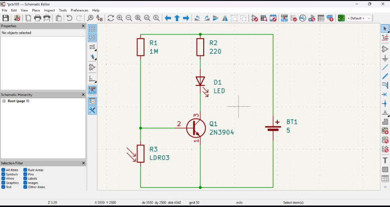

# Journal du 07-09-2026 (Rédigé par: AMAVI Améyo)
## Fait aujourd'hui

- Téléchargement et installation du logiel kicard

Cours sur la fabrication du PCB

- Définition de PCB: Printed Circuit Board(circuit imprimé)
- Anatomie d'un pcb: étude des éléments clés qui composent un circuit imprimé: subsrtat, cuivre, masque de soudure, sérigraphie, vias, trou du montage
- Faire un circuit imprimé avec kicard

## Appris

J'ai appris à fabriquer la plaquette pcb constituée des composants suivants: deux(02)résistances, une photo-résistance(LDR), un transistor,une led et la battérie de 5V à partir des étapes suivantes:
- Disposition des composants sur la feuille technique et réalisation des connexions avec l'outilde liaison(fils électrique)
- Assignation des emprientes
- Routage: traçage des pistes de connexion électique entre les différents pads des composants
- Passage en mode visualisation 3D

## Echec

Difficulté à faire correctement une plaquette PCB

## Décidé

Faires des exercices à la maison