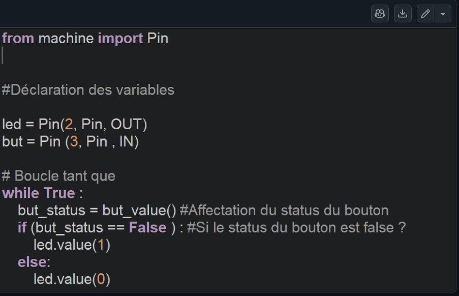

# Journal du 09-09-2026 (Rédigé par: AMAVI Améyo)

## Fait aujourd'hui
**Les procedure de Réaliseation d'un projet**

1. Conception d'un PCB à partir d'un schéma électronique.

  

- Importation des bibliothèques nécessaires pour les composants.
- Importation de la bibliothèque du XIAO ESP32.
- Création de bibliothèques personnalisées pour les composants ne disposant pas de bibliothèque adaptée.
- Création d'une bibliothèque pour un écran OLED.

2. Cours de programmation

Introduction aux notions fondamentales de programmation.

- Étude des notions suivantes :
variables ;
boucles ;
fonctions ;
structures conditionnelles ;
commentaires ;
opérateurs arithmétiques ;
opérateurs logiques ;
opérateurs de comparaison ;
opérateur d'affectation.
- Opérateurs étudiés

Opérateurs arithmétiques :
addition + ;
soustraction - ;
multiplication * ;
modulo %.

Opérateurs logiques :
AND ;
OR ;
NOT.

Opérateurs de comparaison :
égalité ;
différence ;
supérieur ;
inférieur ;
supérieur ou égal ;
inférieur ou égal.

Opérateur d'affectation :
permet d'attribuer une valeur à une variable.
3. Notions générales en informatique.

Définition des concepts fondamentaux :
ordinateur ;
informatique ;
programmation ;
langage de programmation.

Découverte du langage machine et de son rôle dans l'exécution des instructions par l'ordinateur.

4. Programmation en python.

- réalisation d'un programme permettant d'allumer une LED.

Cette activité nous a permis de faire le lien entre la programmation et la commande d'un composant électronique réel.

CodeAllumageLED

## Appris

- Compréhension des différentes étapes de conception d'un PCB à partir d'un schéma électronique.
- Importation et utilisation de bibliothèques de composants.
- Création de bibliothèques personnalisées pour des composants spécifiques.
- Découverte des principales notions de programmation.
- Utilisation des variables, boucles, fonctions et structures conditionnelles.
- Compréhension des différents types d'opérateurs.
- Compréhension du rôle des commentaires dans un programme.
- Découverte du langage machine.
- Mise en pratique de la programmation à travers la commande d'une LED.

## Raté, puis corrigé

- J'ai raté le PCB car la 
Bibliothèque du XIAO ESP32 et de l'écran OLED non disponible, Les composants n'étaient pas présents dans les bibliothèques utilisées,Importation de la bibliothèque du XIAO	et de l'ecran OLED, Composants disponibles pour la conception.
- Difficultés lors du premier programme LED, découverte de la programmation et de la commande d'un composant, essais et corrections du programme,	meilleure compréhension du fonctionnement d'un programme

## Décidé

- Continuer la conception du PCB à partir du schéma électronique.
- Améliorer la maîtrise des bibliothèques de composants.
-  créer des bibliothèques personnalisées lorsque nécessaire.
- Continuer l'apprentissage de la programmation.
- Pratiquer davantage les boucles, fonctions et structures conditionnelles.
- Réaliser d'autres programmes simples pour commander les composants électroniques.

## A faire demain

- Faire le codage et bl'impression du PCB
- Continuer les traveaux sur les projets de groupe

