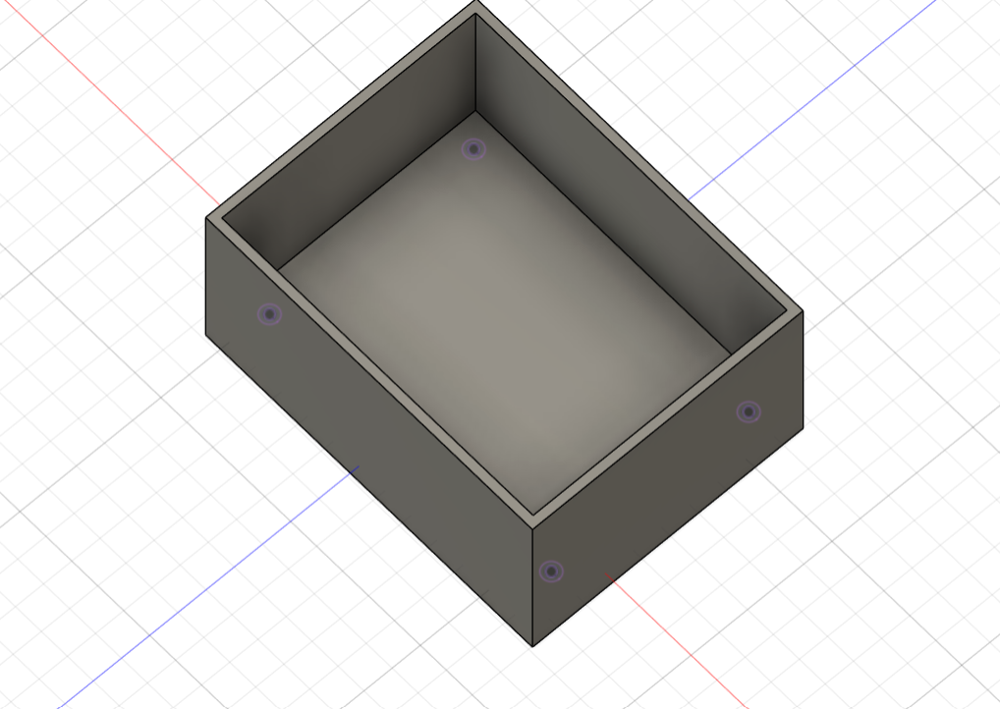

# Journal du 10-09-2026 (Rédigé par: AMAVI Améyo)

## Fait aujourd'hui

Présence et appel.

 **Travail sur le projet: Systtème d'extinction automatique d'un atelier**

Nous avons consacré la journée au travail sur notre projet

J'ai commencé la modélisation du boîtier destiné à contenir les différents composants du système.

Image : Modélisation du boîtier

Nous avons réalisé le plan du montage afin de mieux organiser les différents éléments du projet.

Nous avons commencé à faire un montage 0 pour texté le fonctionnemt des composants comme: un XIAO ESP32S3, une résistance et une LED

Nous avons fait le point sur les matériels disponibles et ceux qui sont encore nécessaires pour poursuivre les essais.

 **Répartition du travail**

Nous avons discuté de l'avancement de notre projet.

Nous avons réparti le travail entre nous afin que chacun puisse avancer sur une partie du projet.

J'ai pris en charge la poursuite de la modélisation du boîtier.

Cette répartition nous permettra de travailler sur les différentes parties du projet de manière organisée.

## Appris

- réaliser un plan avant de commencer le montage d'un système.
- Importance de vérifier la disponibilité de tous les composants avant de réaliser les essais.
- bImportance de prendre en compte les dimensions réelles des composants lors de la modélisation d'un boîtier.
- Importance de bien répartir le travail pour faciliter l'avancement d'un projet de groupe.
- Importance des essais pratiques 

## Raté, puis corrigé

Le montage 0 n'a pas terminé en raison du XIAO ESP32S3 que nous n'avions pas identifier en temps que ce n'est flaché

## Décidé

- Continuer la modélisation du boitier
- Reprendre le montage 0 lorsque XIAO est flaché

## A fait demain

- Poursuivre la modélisation du boitier
- Continuer progressivemt les essais du montage

