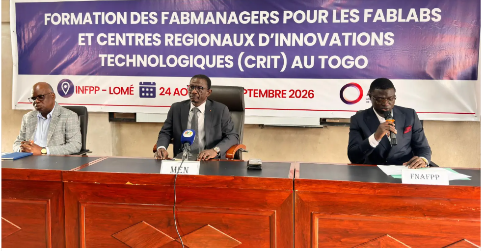
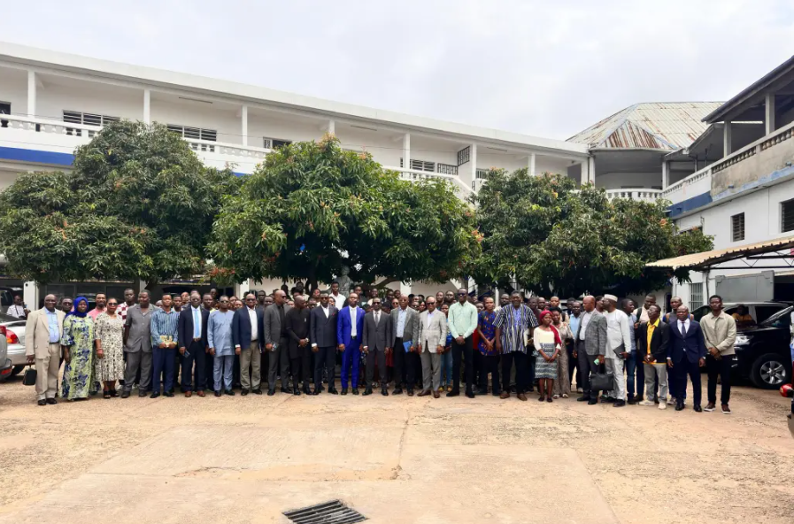

# Journal du 24 août 2026 (rédigé par : AMAVI Améyo)

**F0RMATION DES FABMANAGERS POUR LES FABLABS ET LES CENTRES REGIONAUX D'INNOVATION TECHNOLOGIQUES (CRIT) AU TOGO**

   Date: 24-08-2026; Lieu: L'INFPP de lome-togo: Nombre de participantgs: cent un (101)
## Fait aujourd'hui
- Mise en place
- Debut de la cérémonie avec les mots de bienvenus du sécrétaire de INFPP suivi d'une présentation introduisant l'idée des fabmanagres qui est de faire de leurs espaces éduicatives, un espace d'apprentissage pratique
-  le lancement officiel de la formation des fabmanagers par MEN(Ministre de l'Education National) 
- Cours sur la documentation: documenter avec git, github et github pages

## Ce que je retiens

- Je retiens qu'attend qu'un fabmanager,  mon devoir est d'amener les apprenant à traduire les théories de mathématiques, physique et chimie en applications concrètes
- je reetiens l'importance de la documentation : documentation est cherché à mettre en écrit
- Je retiens également les grands axes de la documentation: qu'est ce que la documentation: documentation est le faite de chercher à mettre en écrit; les quatre fonctions de la documentation: mémoire, preuve, transmission, contribution; les cinq principes de la documentation: quotidoenne, datée et signée, honnête, complète, réutilisable; les outils utilisés pour la documentation: vs code, git, github, github pages. 

## Décidé

- je décide de bien suivre la formation

## À faire demain

- Installation et découverte des logiciel comme vs code, git et github

**PHOTOS DU JOUR**

