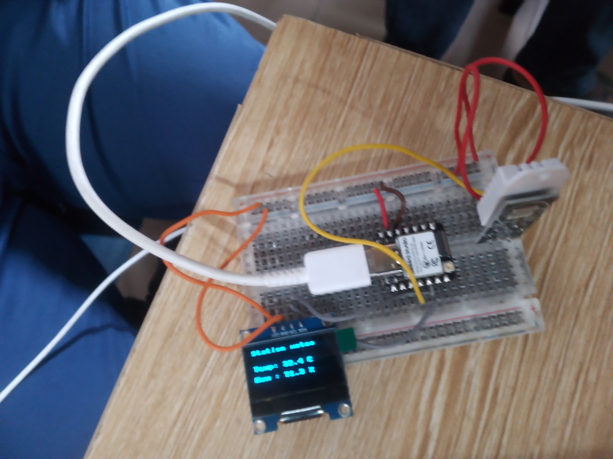

# Journal du 05-09-2026 (Rédigé par: AMAVI Améyo)

## Fait aujourd'hui
Réalisez un prototype de station météo qui mesure et affiche la température et l'humidité à l'aide d'un ESP32S3 + Capteur + écran OLED.

## Appris
- Câbler un ESP32S3 +capteur + écran OLED
- Installer le micropython
- Faire le codage et compiler
## Raté, puis corrigé
Montage mal fait pour le premier essai à cause du branchement et est corrigé en envoyant le code
## Décidé
Réaliser les types de câblage avec d'autres composant sur breabord
## A faire demain
Travail dans les ateliers